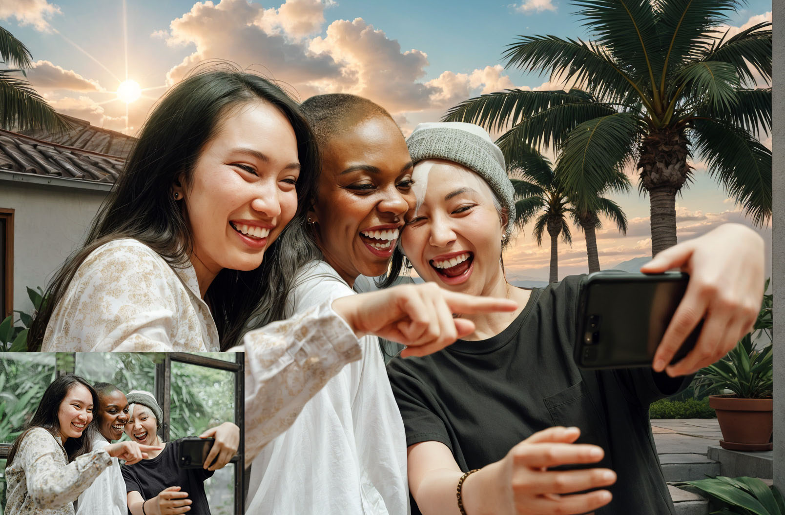

# Workflow

## Change Background ++ （Redraw background, clothes, hair, face…and Generate foregrounds）

[openart workflow](https://openart.ai/workflows/grinlau/change-background-redraw-background-clothes-hair-faceand-generate-foregrounds/DoiYOkLj6ikwIbygd4gY)

